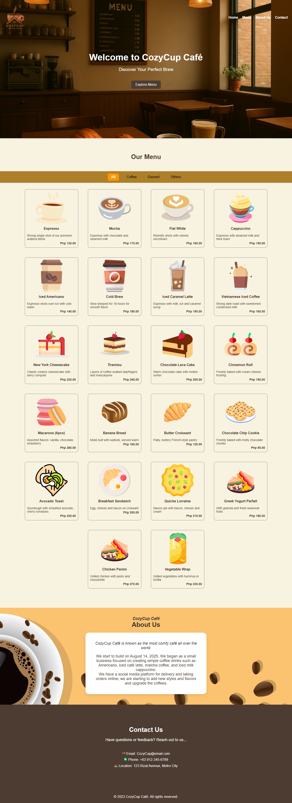
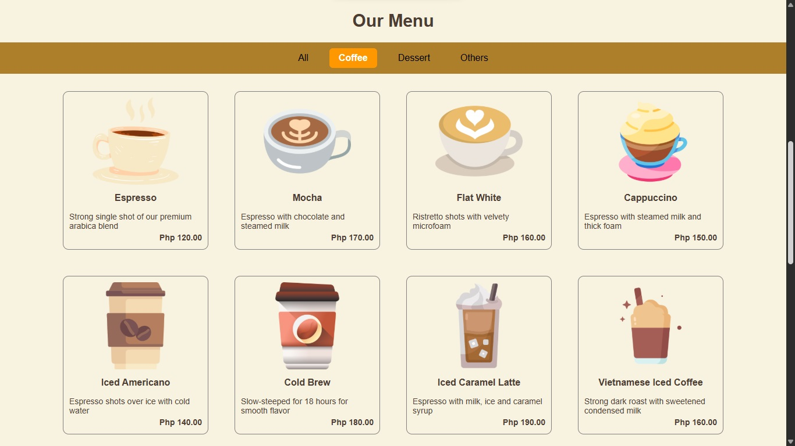
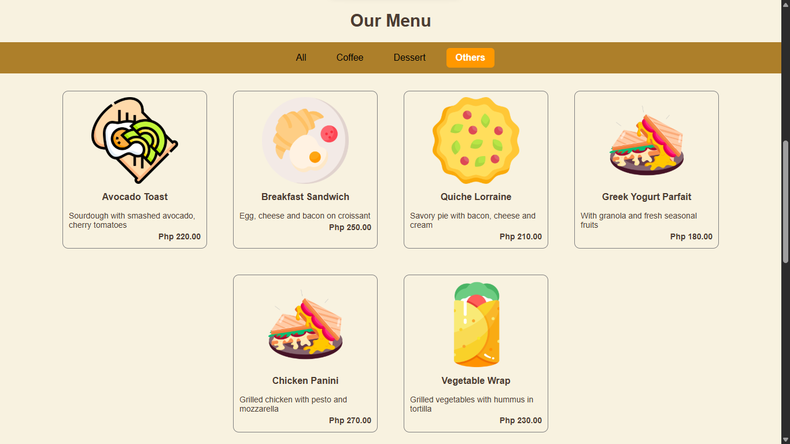

# ☕ CozyCup Café  
---

## 🌟 Project Description
Welcome to **CozyCup Café** — your cozy spot for freshly brewed coffee, homemade pastries, and relaxing vibes.  

This project is the official website for CozyCup Café, featuring information about our history, menu, and online ordering system.  

- 📅 Established: August 14, 2025  
- ☕ Started as a small shop serving Americano, Iced Café Latte, Matcha Coffee, and Iced Milk Cappuccino.  
- 📲 Now available for **online orders & delivery** via social media platforms.  
- 🍰 Continuously upgrading with new flavors and unique coffee styles.  

---

## ✨ Features  

- Responsive **homepage** with café introduction  
- **About Us** section with history and story of the café  
- **Menu page** showcasing coffee & pastries  
- Background images for cozy vibes  
- Modern responsive layout with HTML + CSS  
- Future support for **online orders**  

---

## 📸 Screen Captures

  

---

## 📝 About the Authors
 

**Name:** Reymart Dela Cruz 
**Email:** 202380019@psu.palawan.edu.ph  

 
  

**Name:** John Brence Condesa 
**Email:** 202380030@psu.palawan.edu.ph

 
 
